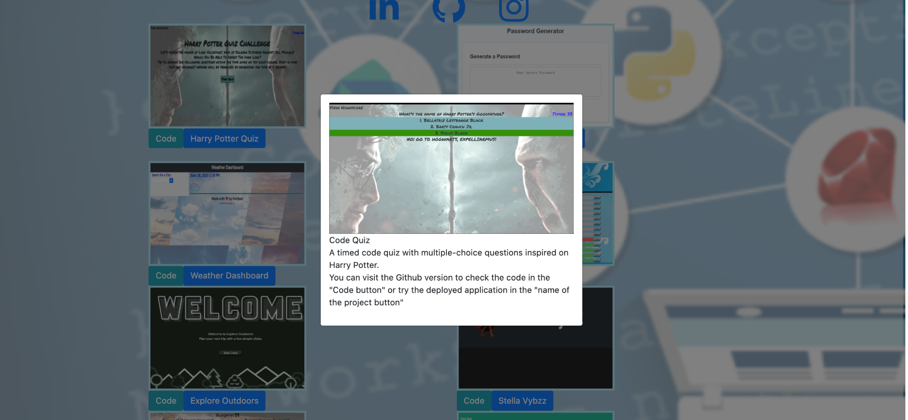
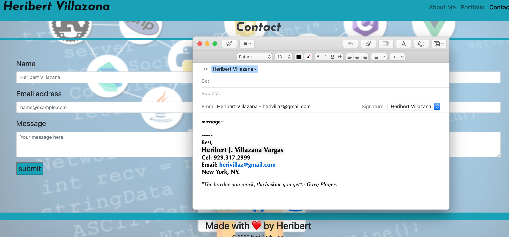
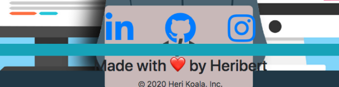
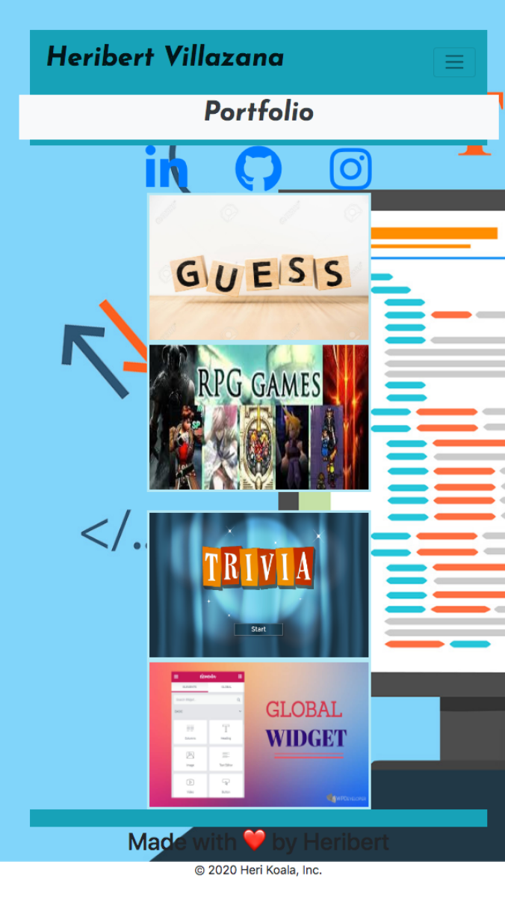

# portfolio
react portfolio

# Portfolio
## **This is my updated portfolio**
Welcome to my first Portfolio.
## This project was built with Bootstrap resources, including rows, columns, navbar, forms and style fonts and background. It's also accomplished by individual style on CSS, and icons taken from FontAwesome, a nice resource as Bootstrap and Google Fonts.

* The index.html page looks like this:

### You can access here: [Portfolio](https://herivillaz.github.io/Portfolio_updated/)

* As we can see it's provided by a Responsive Navbar 

* This Navigation Bar contains responsive links that take you to other sections:
* **About me**
* **Portfolio**
* **Contact**

* About Me contains the small Biography of Me (Heribert Villazana) plus responsive links to My social Networking, these links you will find also on Portfolio and Contact.

* **This is the portfolio section page**

* It contains images about previews of my projects as a Full Stack web developers. by clicking of the images the users can look the descriptions and also go to the code and deployed versions.

* **This is the Contact section page**

* It's integrated by a form composed of Name, email, message and of course a submit button to send this information. 

* When the user click on the submit button is taken to their personal email to contact me.

* Every page also has a footer. Describing created for ... and a model of copyright.

* On an `xs` screen, content takes up the entire screen. Also in `sm` screens and larger screens there are implemented margins. Taking in consideration that also the Navigation bar adjusts to the screen.

# Contribution
If you would like to contribute please create an issue. Alternatively, clone this repo and make modifications to your copy.

# Author
* Heribert Villazana
* Github: herivillaz

## Contact
herivillaz@gmail.com

* Hope you like my project. I would appreciate your feedback to make this better. Thank You.

## ** Best, Heribert Villazana**